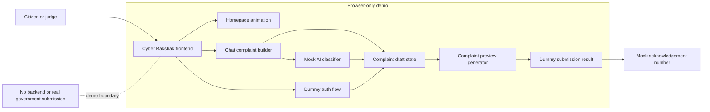
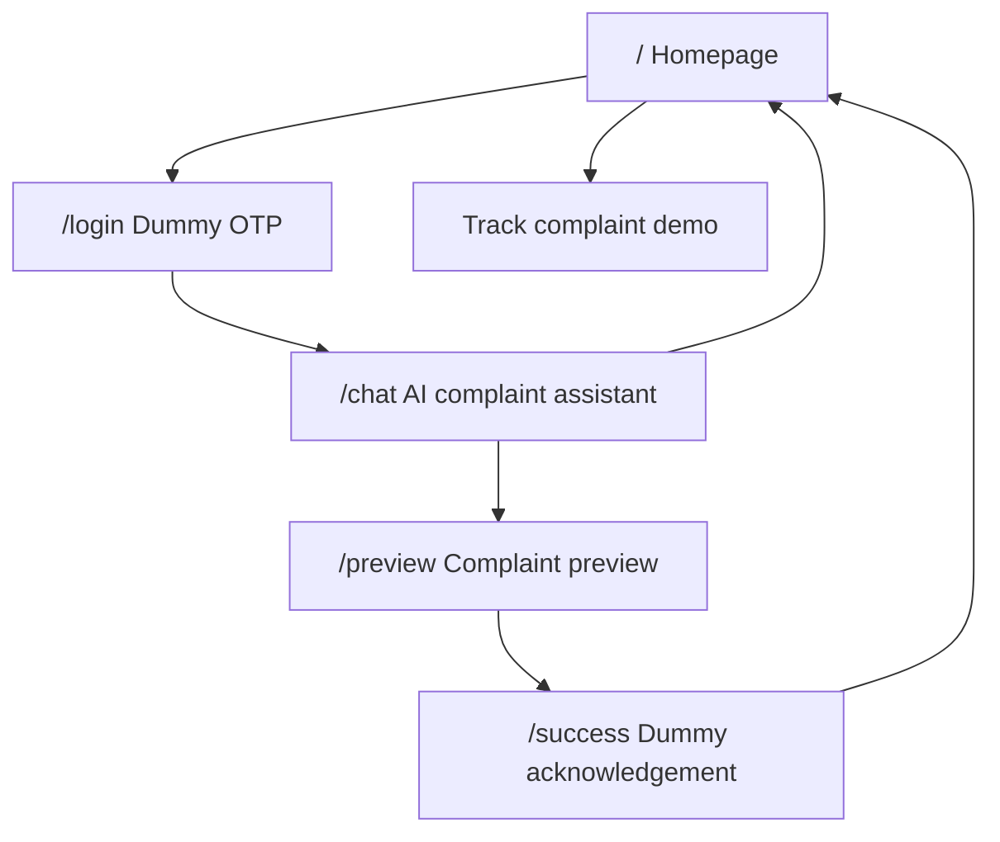
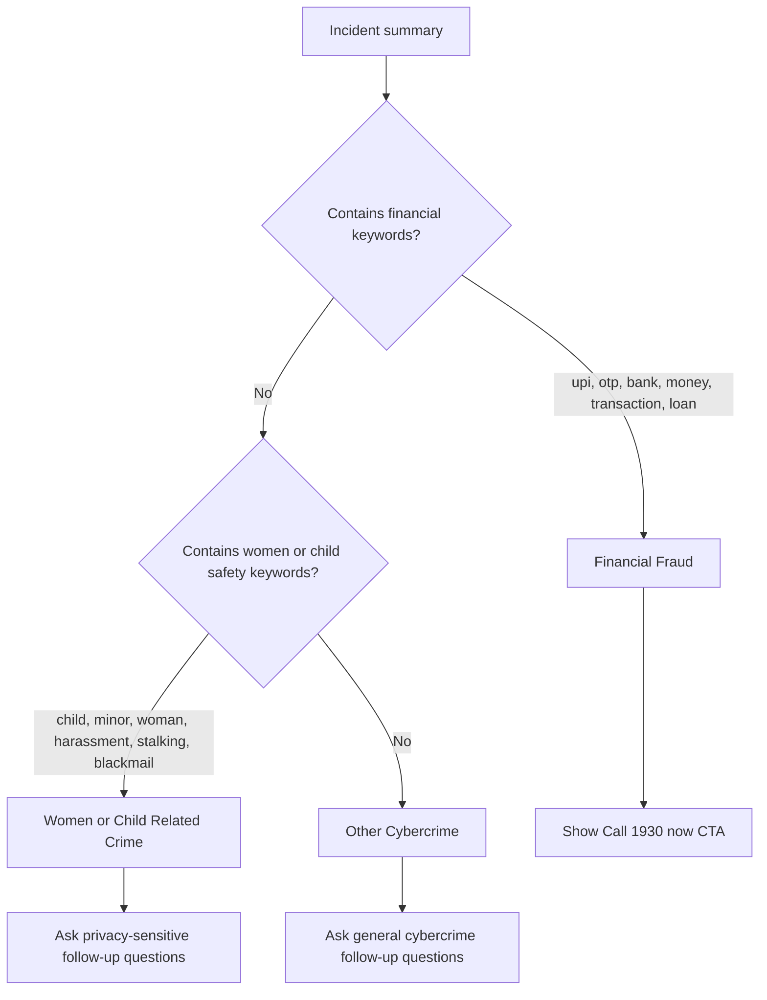
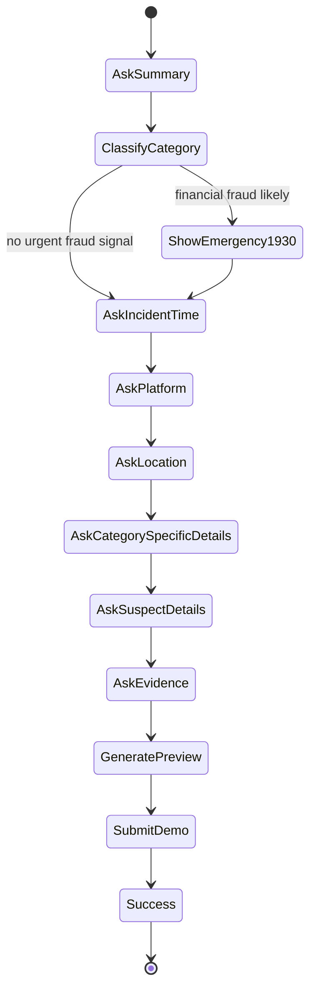
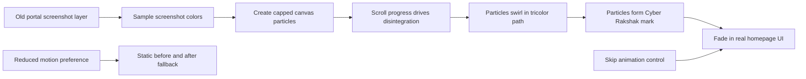

# Cyber Rakshak Architecture

## 1. Architecture Goal

The hackathon prototype should look and feel like an AI-powered government reporting portal while staying simple enough to build quickly. There is no backend, no real AI service, no live OTP, and no real complaint submission. All state can live in the browser using mock data.

## 2. Suggested Frontend Stack

Recommended:

- React or Next.js for screen routing and component structure.
- TypeScript for safer mock complaint data.
- CSS modules, Tailwind, or a small design-token stylesheet.
- Framer Motion or GSAP for the homepage transformation animation.
- Canvas for particle animation.
- Local browser state for chat progress.

If the prototype is built as a static demo, Vite + React is enough.

## 3. High-Level System



## 4. App Routes



## 5. Component Map

```mermaid
flowchart TD
    AppShell --> Header
    AppShell --> LanguageToggle
    AppShell --> Emergency1930Pill
    AppShell --> HomePage
    AppShell --> LoginPage
    AppShell --> ChatPage
    AppShell --> PreviewPage
    AppShell --> SuccessPage

    HomePage --> PortalTransformHero
    HomePage --> TrustCues
    HomePage --> StartReportCTA

    LoginPage --> MobileNumberForm
    LoginPage --> StateSelect
    LoginPage --> OtpForm
    LoginPage --> DemoLoginButton

    ChatPage --> ChatThread
    ChatPage --> ChatComposer
    ChatPage --> SuggestedReplyChips
    ChatPage --> EvidenceUploader
    ChatPage --> ComplaintSummaryPanel
    ChatPage --> CategoryConfidenceCard
    ChatPage --> Emergency1930Pill

    PreviewPage --> ComplaintPreview
    PreviewPage --> EditableFieldGroup
    PreviewPage --> SubmitDemoButton

    SuccessPage --> AcknowledgementCard
    SuccessPage --> TrackComplaintCTA
```



## 6. Mock Data Model

```ts
type ComplaintCategory =
  | "women_child_related_crime"
  | "financial_fraud"
  | "other_cybercrime";

type ComplaintDraft = {
  acknowledgementId?: string;
  language: "en" | "hi";
  category?: ComplaintCategory;
  subCategory?: string;
  confidence?: number;
  complainant: {
    name?: string;
    mobile?: string;
    state?: string;
  };
  incident: {
    summary?: string;
    date?: string;
    time?: string;
    platform?: string;
    location?: string;
    description?: string;
  };
  financial?: {
    amountLost?: number;
    paymentMethod?: string;
    transactionId?: string;
    bankOrWallet?: string;
  };
  suspect?: {
    phone?: string;
    email?: string;
    url?: string;
    socialHandle?: string;
    upiId?: string;
  };
  evidence: Array<{
    id: string;
    name: string;
    type: string;
    mockSize: string;
  }>;
};
```

## 7. Mock AI Classifier

The demo classifier can use keyword rules. This keeps the prototype reliable during judging.

Example logic:



The UI should present the result as an assistant suggestion, not a final legal decision.

Example:

```text
"This looks like Financial Fraud. I will prepare the complaint under that category unless you want to change it."
```

## 8. Chat Flow State Machine



## 9. Category-Specific Questions

### Financial Fraud

- How much money was lost?
- When did the transaction happen?
- Which payment method was used?
- Do you have a transaction ID or UTR number?
- Do you know the caller, UPI ID, account number, app, or website involved?
- Have you called 1930 yet?

### Women/Child Related Crime

- Is the affected person a woman, child, or guardian reporting on behalf of someone?
- What platform did this happen on?
- Is there immediate danger or ongoing threat?
- Do you have screenshots, profile links, phone numbers, or chat records?
- Would the user prefer privacy-sensitive reporting language?

### Other Cybercrime

- Was an account hacked?
- Was there phishing, malware, impersonation, or fake profile activity?
- Which platform or website was involved?
- What evidence is available?
- Is the issue still ongoing?

## 10. Homepage Animation Architecture

Recommended approach:



1. Show the old portal screenshot as a flat image layer.
2. Use canvas particles sampled from the screenshot or generated in tricolor clusters.
3. On scroll, fade and break the screenshot into particles.
4. Move particles in a circular swirl using requestAnimationFrame.
5. Resolve the particles into the Cyber Rakshak wordmark or homepage layout silhouette.
6. Fade in actual homepage UI after the animation completes.

Performance guidance:

- Cap particles around 1,200 to 2,000 for laptops.
- Use reduced particle count on mobile.
- Respect `prefers-reduced-motion`.
- Include a `Skip animation` control.
- Use a static fallback image if canvas fails.
- Avoid animating layout-heavy DOM nodes during the transformation.

## 11. Language Architecture

Demo languages:

- English
- Hindi

Future roadmap:

- Tamil
- Telugu
- Kannada
- Malayalam
- Bengali
- Marathi
- Gujarati
- Punjabi
- Odia
- Assamese

Implementation for demo:

- Store UI copy in a small local dictionary.
- Use `language` on the complaint draft.
- Translate only key UI labels, chat prompts, and CTA text for the demo.
- Show regional languages as disabled or "Coming soon" in the language menu.

## 12. Privacy and Safety

Because this is a demo:

- Show a visible "Demo only, no real complaint submitted" label.
- Do not ask judges to enter real personal data.
- Use sample files for evidence upload.
- Keep all data in memory or local browser state.
- Clear demo state with a reset button.

## 13. Submission Simulation

On demo submit:

```text
Generate acknowledgement ID:
CR-2026-08-0001930

Status:
Submitted for demo review

Next step:
Track complaint from dashboard
```

No network request is required.
