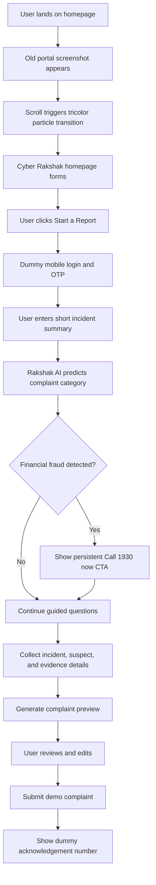

# Cyber Rakshak PRD

## 1. Product Vision

Cyber Rakshak is a hackathon redesign concept for India's cybercrime reporting experience. Instead of forcing citizens through a long multi-page form, the portal uses a calm AI chatbot interface that understands a short incident summary, identifies the correct complaint category, asks only the necessary follow-up questions, and prepares a complaint preview using dummy data for the demo.

The goal is to make reporting feel less like filling a government form and more like speaking to a trained digital helper.

## 2. Problem

The existing cybercrime reporting portal asks users to understand categories, register or log in, select sub-categories, enter incident details, upload evidence, preview, agree, submit, and save the acknowledgement number. This is hard for people who are stressed, panicked, unfamiliar with legal categories, or unsure what evidence matters.

Common user frustrations:

- Users do not know whether their case is financial fraud, women/child related crime, or another cybercrime.
- The process feels form-heavy before the user has explained what happened.
- Emergency financial fraud victims may waste time when they should immediately call 1930.
- Evidence requirements are unclear until late in the flow.
- Government UI feels visually overloaded and intimidating.
- Users need reassurance that they are doing the right thing.

## 3. Target Users

- A citizen who lost money through UPI, card, net banking, investment scam, job fraud, or impersonation.
- A parent or guardian reporting harassment, blackmail, grooming, or abuse affecting a child.
- A woman reporting cyberstalking, image misuse, threats, harassment, or impersonation.
- A general user reporting phishing, account hacking, fake profiles, malware, or online abuse.
- A first-time user who does not understand cybercrime reporting terminology.

## 4. Product Goals

- Reduce cognitive load by replacing category-first form filling with conversation-first complaint creation.
- Detect urgent financial fraud early and show a persistent `Call 1930 now` CTA.
- Auto-classify the complaint category and sub-category from the user's summary.
- Ask contextual questions one at a time.
- Convert chat answers into a structured complaint preview.
- Allow users to review and correct extracted details before submission.
- Make the interface feel official, trustworthy, modern, and accessible.
- Create a memorable hackathon demo moment through the old-site-to-new-site transformation animation.

## 5. Non-Goals

- No real complaint submission to government systems.
- No real authentication, OTP, or backend.
- No real AI model integration required for the demo.
- No real document verification.
- No storage of actual personal data.
- No legal advice or final criminal classification.

## 6. Demo Scope

The hackathon prototype includes:

- Homepage with transformation hero animation.
- Sign in / login page with dummy OTP flow.
- Chat interface powered by dummy AI logic.
- English and Hindi toggle in the interface.
- Future regional-language support shown as part of the product direction.
- Emergency financial fraud pill below the chatbox: `Call 1930 now`.
- Auto-generated complaint preview.
- Dummy acknowledgement success screen.

## 7. Core User Flow

1. User lands on the homepage.
2. Old cybercrime portal screenshot appears as the starting state.
3. On scroll, the screenshot disintegrates into saffron, white, green, and Ashoka blue particles.
4. Particles circle and reform into the new Cyber Rakshak homepage.
5. User clicks `Start a Report`.
6. User signs in using mobile number and dummy OTP.
7. User enters a short summary in the chatbot.
8. Cyber Rakshak analyzes the summary and predicts the category.
9. Chatbot asks follow-up questions based on the predicted category.
10. User uploads or selects dummy evidence files.
11. Chatbot prepares a complaint preview.
12. User reviews details and clicks `Submit demo complaint`.
13. Success screen shows dummy acknowledgement number and tracking status.

## 8. Primary Screens

### Homepage

Purpose: Introduce the redesign, build trust, and invite the user to start reporting.

Key elements:

- Old portal transformation animation.
- Cyber Rakshak brand identity.
- Primary CTA: `Start a Report`.
- Secondary CTA: `Track Complaint`.
- Emergency strip: `Financial fraud? Call 1930 now`.
- Language toggle: English / Hindi.
- Short trust cues: Government-grade privacy, guided reporting, evidence checklist.

### Login Page

Purpose: Keep access simple and familiar while reducing friction.

Key elements:

- Mobile number field.
- State selector.
- Dummy OTP input.
- Login button.
- Guest demo mode for judges.
- Language toggle.

### Chat Interface

Purpose: Replace long forms with an adaptive complaint assistant.

Key elements:

- Chat messages.
- Suggested reply chips.
- Complaint category confidence card.
- Evidence upload area.
- Live complaint summary panel.
- Persistent emergency pill below the chatbox: `Call 1930 now`.
- Language selector with English and Hindi active, regional languages shown as future support.

## 9. Chatbot Behavior

The chatbot should:

- Start with a short, reassuring prompt: "Tell me what happened in one or two lines."
- Detect whether the complaint may involve financial fraud.
- Immediately surface `Call 1930 now` when money loss or active transaction fraud is mentioned.
- Predict one of three top-level categories:
  - Women/Child Related Crime
  - Financial Fraud
  - Other Cybercrime
- Ask follow-up questions only relevant to the incident.
- Show why it is asking for sensitive details.
- Avoid legal jargon.
- Convert answers into structured complaint fields.
- Show a preview before final submission.

Example initial user summary:

> Someone called me pretending to be from my bank and made me share an OTP. Rs 25,000 was deducted from my account.

Example assistant response:

> This looks like a financial fraud case. Since money was deducted, please call 1930 now if the transaction happened recently. I will also help prepare your complaint. When did this happen?

## 10. Required Complaint Fields

The demo should collect:

- Complaint category.
- Complaint sub-category.
- Incident date and time.
- Platform or channel used.
- Location or state.
- Incident description.
- Amount lost, if financial fraud.
- Bank, UPI, wallet, card, or transaction details, if applicable.
- Suspect phone number, email, URL, social media handle, or UPI ID, if known.
- Evidence files such as screenshots, transaction receipts, chats, emails, or profile links.
- Complainant name, mobile number, and state from login.

## 11. Dummy Data Rules

- Use mocked login credentials.
- Use dummy OTP such as `123456`.
- Use sample complaint categories and sub-categories.
- Use local mock complaint acknowledgement numbers such as `CR-2026-08-0001930`.
- Do not send any data outside the browser.
- All AI classification can be simulated with keyword-based dummy logic.

## 12. Success Metrics for Hackathon

- Judge understands the problem in under 15 seconds.
- User can begin reporting in one click.
- User does not need to manually choose a complaint category.
- Emergency financial fraud action is visible without completing the AI flow.
- Complaint preview feels complete and official.
- UI feels significantly calmer than the current portal.
- Demo animation creates a clear before/after moment.

## 13. Risks

- Too much animation may slow the demo or distract from the core reporting flow.
- Overpromising AI accuracy may make the concept feel unsafe.
- Sensitive cybercrime scenarios require careful tone.
- The design must feel official, not playful or casual.

## 14. Recommended Hackathon Positioning

Cyber Rakshak is not just a visual redesign. It is a workflow redesign. It changes the portal from "citizen fills a complex form" to "citizen explains the problem and the system prepares the form."
