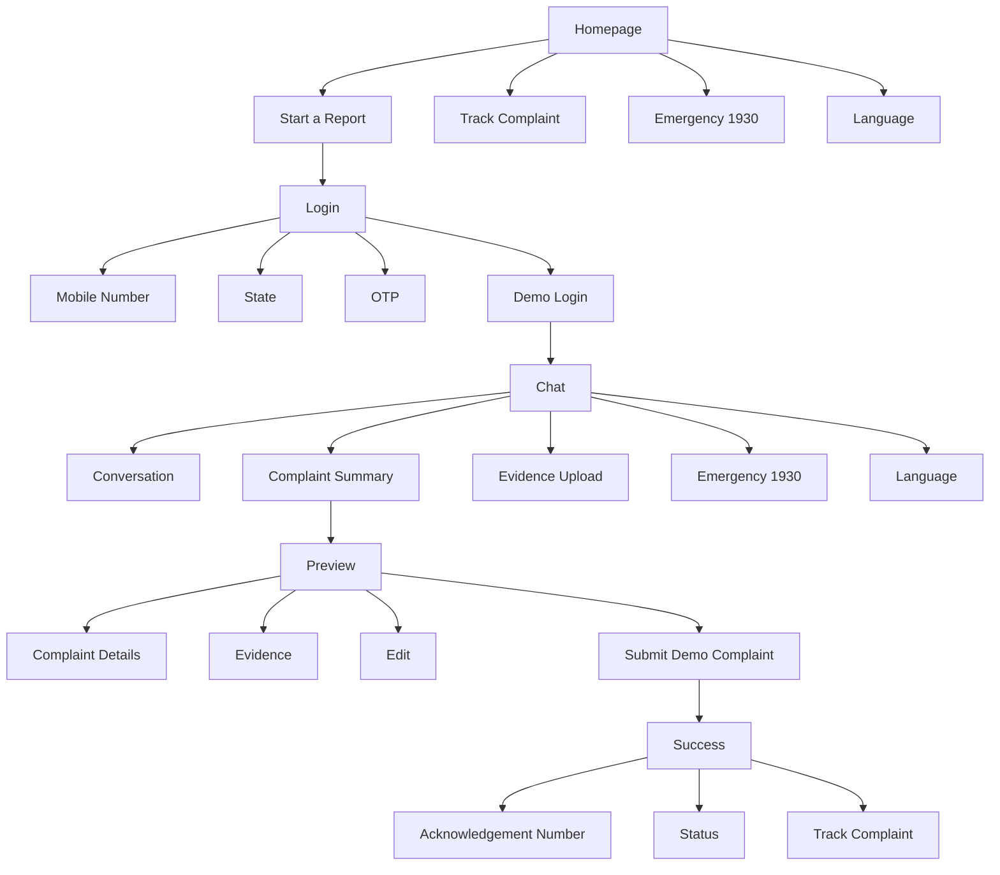
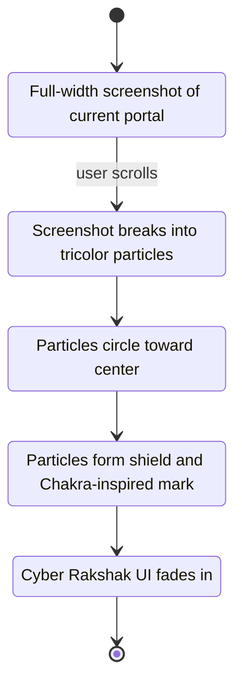

# Cyber Rakshak UI Layouts

## 1. Information Architecture



## 2. Homepage Layout

### Desktop

```text
┌──────────────────────────────────────────────────────────────┐
│ Header: Cyber Rakshak        Track Complaint   EN | हिन्दी   │
├──────────────────────────────────────────────────────────────┤
│                                                              │
│  [Old portal screenshot transforms into particles]            │
│                                                              │
│  Cyber Rakshak                                                │
│  Tell us what happened. We will prepare the report.           │
│                                                              │
│  [Start a Report] [Track Complaint]                           │
│                                                              │
│  Financial fraud? [Call 1930 now]                             │
│                                                              │
├──────────────────────────────────────────────────────────────┤
│ Guided reporting | Evidence checklist | Private by design     │
└──────────────────────────────────────────────────────────────┘
```

### Mobile

```text
┌──────────────────────────────┐
│ Cyber Rakshak        हिन्दी  │
├──────────────────────────────┤
│ [Transformation hero]         │
│ Cyber Rakshak                 │
│ Tell us what happened.        │
│ We will prepare the report.   │
│ [Start a Report]              │
│ [Track Complaint]             │
│ [Call 1930 now]               │
└──────────────────────────────┘
```

## 3. Homepage Animation Layout

### Animation Stages



### Controls

```text
[Skip animation]
[Reduce motion detected: show static before/after transition]
```

## 4. Login Page Layout

### Desktop

```text
┌──────────────────────────────────────────────────────────────┐
│ Cyber Rakshak                                      EN | हिन्दी│
├──────────────────────────────────────────────────────────────┤
│                                                              │
│  Sign in to continue                                         │
│  Your complaint draft will be prepared after verification.    │
│                                                              │
│  ┌────────────────────────────────────────────────────────┐  │
│  │ Mobile number                                          │  │
│  │ [ +91 98765 43210                         ]            │  │
│  │ State                                                  │  │
│  │ [ Telangana                               v]            │  │
│  │ [Send OTP]                                              │  │
│  │                                                        │  │
│  │ OTP                                                    │  │
│  │ [ 1 ][ 2 ][ 3 ][ 4 ][ 5 ][ 6 ]                          │  │
│  │ [Continue]                                             │  │
│  │                                                        │  │
│  │ Demo prototype: use OTP 123456                          │  │
│  └────────────────────────────────────────────────────────┘  │
│                                                              │
└──────────────────────────────────────────────────────────────┘
```

### UX Notes

- Keep form short.
- Let judges continue quickly with a visible demo OTP.
- Do not ask for too many personal details before the complaint starts.
- Keep emergency `Call 1930 now` available in the footer or header.

## 5. Chat Interface Layout

### Desktop

```text
┌──────────────────────────────────────────────────────────────────────┐
│ Cyber Rakshak       New Report      Track Complaint      EN | हिन्दी │
├──────────────────────────────────────────────────────────────────────┤
│                                                                      │
│ ┌────────────────────────────────────────┐ ┌───────────────────────┐ │
│ │ Rakshak AI                             │ │ Complaint Summary     │ │
│ │                                        │ │ Category              │ │
│ │ AI: Tell me what happened in           │ │ Financial Fraud       │ │
│ │ one or two lines.                      │ │ Confidence: 92%       │ │
│ │                                        │ │                       │ │
│ │ User: Someone took my OTP and          │ │ Incident Details      │ │
│ │ money was deducted.                    │ │ Date: Pending         │ │
│ │                                        │ │ Amount: Pending       │ │
│ │ AI: This looks like financial fraud.   │ │ Evidence: 0 files     │ │
│ │ If this happened recently, call 1930.  │ │                       │ │
│ │ When did it happen?                    │ │ [Preview Complaint]   │ │
│ │                                        │ └───────────────────────┘ │
│ │ [Today] [Yesterday] [Choose date]       │                           │
│ │                                        │                           │
│ │ ┌────────────────────────────────────┐ │                           │
│ │ │ Tell Rakshak AI what happened...   │ │                           │
│ │ │                         [Upload][→]│ │                           │
│ │ └────────────────────────────────────┘ │                           │
│ │ [Call 1930 now]                        │                           │
│ └────────────────────────────────────────┘                           │
└──────────────────────────────────────────────────────────────────────┘
```

### Mobile

```text
┌──────────────────────────────┐
│ Cyber Rakshak        हिन्दी  │
├──────────────────────────────┤
│ Rakshak AI                   │
│                              │
│ AI: Tell me what happened.   │
│ User: My UPI was hacked.     │
│ AI: This may be financial    │
│ fraud. Call 1930 now if      │
│ money was deducted recently. │
│                              │
│ [Today] [Yesterday]          │
│                              │
│ [Complaint summary ▴]        │
│ ┌──────────────────────────┐ │
│ │ Message...        [↑]    │ │
│ └──────────────────────────┘ │
│ [Call 1930 now]              │
└──────────────────────────────┘
```

## 6. Chat Message Types

### Assistant Message

```text
Rakshak AI
This looks like Financial Fraud. I will help prepare the complaint under that category unless you want to change it.
```

### User Message

```text
I shared an OTP and Rs 25,000 was deducted.
```

### Category Card

```text
Suggested category
Financial Fraud
92% match
[Looks right] [Change category]
```

### Emergency Card

```text
Money deducted recently?
Call 1930 now to improve the chance of stopping the transaction.
[Call 1930 now]
```

### Evidence Upload Prompt

```text
Upload anything that can help:
Screenshots, transaction receipt, chat messages, phone number, UPI ID, website link.
[Upload evidence]
```

## 7. Hindi Interface Examples

Homepage CTA:

```text
रिपोर्ट शुरू करें
```

Chat placeholder:

```text
बताइए क्या हुआ...
```

Emergency pill:

```text
1930 पर अभी कॉल करें
```

Assistant greeting:

```text
नमस्ते, मैं Rakshak AI हूं। एक-दो लाइनों में बताइए क्या हुआ।
```

Future language menu:

```text
English
हिन्दी
தமிழ் - Coming soon
తెలుగు - Coming soon
ಕನ್ನಡ - Coming soon
বাংলা - Coming soon
मराठी - Coming soon
ગુજરાતી - Coming soon
```

## 8. Complaint Preview Layout

### Desktop

```text
┌──────────────────────────────────────────────────────────────┐
│ Complaint Preview                                  Edit       │
├──────────────────────────────────────────────────────────────┤
│ Category: Financial Fraud                                    │
│ Sub-category: OTP / Banking Fraud                            │
│                                                              │
│ Incident                                                     │
│ Date: 28 Aug 2026                                            │
│ Time: 4:30 PM                                                │
│ Platform: Phone call + UPI                                   │
│ Amount lost: Rs 25,000                                       │
│                                                              │
│ Suspect Details                                              │
│ Phone: +91 XXXXX XXXXX                                       │
│ UPI ID: example@upi                                          │
│                                                              │
│ Evidence                                                     │
│ screenshot-payment.png                                       │
│ chat-record.pdf                                              │
│                                                              │
│ Declaration                                                  │
│ [ ] I confirm these demo details are correct.                 │
│                                                              │
│ [Submit demo complaint]                                      │
└──────────────────────────────────────────────────────────────┘
```

### UX Notes

- The preview should make users feel in control.
- All fields should be editable.
- Use plain labels instead of legal terms where possible.
- Show which fields were auto-filled by Rakshak AI.

## 9. Success Screen Layout

```text
┌──────────────────────────────────────────────────────────────┐
│ [Check icon] Demo complaint prepared                         │
│                                                              │
│ Acknowledgement number                                       │
│ CR-2026-08-0001930                                           │
│                                                              │
│ Status                                                       │
│ Submitted for demo review                                    │
│                                                              │
│ Next steps                                                   │
│ Save this number to track complaint status.                  │
│ For urgent financial fraud, call 1930 now.                   │
│                                                              │
│ [Track Complaint] [Start another report]                     │
└──────────────────────────────────────────────────────────────┘
```

## 10. Hackathon Demo Script

1. Open homepage.
2. Show old portal screenshot.
3. Scroll and trigger particle transformation.
4. New Cyber Rakshak homepage appears.
5. Click `Start a Report`.
6. Use dummy login and OTP `123456`.
7. Type: "Someone called me from a fake bank number, took my OTP, and Rs 25,000 was deducted."
8. Show automatic Financial Fraud classification.
9. Point out the `Call 1930 now` pill below the chatbox.
10. Answer a few chatbot questions.
11. Upload dummy evidence.
12. Show auto-generated complaint preview.
13. Submit and show acknowledgement number.

## 11. Responsive Behavior

- Desktop: chat and complaint summary side by side.
- Tablet: summary panel can collapse.
- Mobile: summary becomes bottom sheet.
- Composer stays fixed at bottom.
- Emergency CTA remains visible near composer.
- Header stays compact and avoids crowding.

## 12. Visual Priority

Highest priority:

- Chat prompt.
- Emergency 1930 CTA.
- Current question.
- Complaint summary progress.

Medium priority:

- Language toggle.
- Evidence upload.
- Category confidence.

Low priority:

- Decorative animation after homepage.
- Informational trust badges.
- Secondary navigation.
